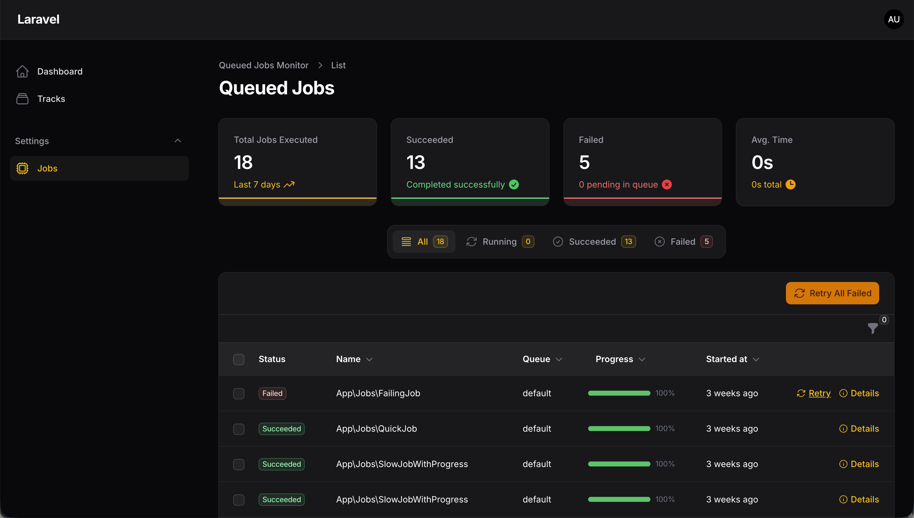
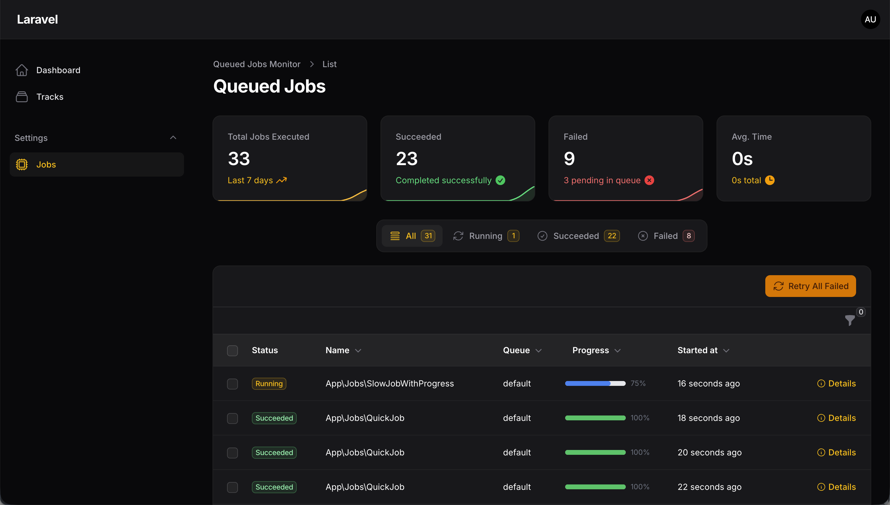

# Background Jobs monitoring like Horizon for all drivers for FilamentPHP

[](https://packagist.org/packages/croustibat/filament-jobs-monitor)
[](https://packagist.org/packages/croustibat/filament-jobs-monitor)

This is a package to monitor background jobs for FilamentPHP. It is inspired by Laravel Horizon and is compatible with all drivers.






## Installation

Check your filamentPHP version before installing:

| Version | FilamentPHP | PHP     |
| ------- | ----------- |---------|
| 1.*     | 2.*         | 8.1     |
| 2.*     | 3.*         | \>= 8.1 |
| 3.*     | 4.*         | \>= 8.1 |
| 4.*     | 5.*         | \>= 8.2 |


Install the package via composer:

```bash
composer require croustibat/filament-jobs-monitor
```

Publish and run the migrations using:

```bash
php artisan vendor:publish --tag="filament-jobs-monitor-migrations"
php artisan migrate
```

## Usage

### Configuration

The global plugin config can be published using the command below:

```bash
php artisan vendor:publish --tag="filament-jobs-monitor-config"
```

This is the content of the published config file:

```php
return [
    'resources' => [
        'enabled' => true,
        'label' => 'Job',
        'plural_label' => 'Jobs',
        'navigation_group' => 'Settings',
        'navigation_icon' => 'heroicon-o-cpu-chip',
        'navigation_sort' => null,
        'navigation_count_badge' => false,
        'resource' => Croustibat\FilamentJobsMonitor\Resources\QueueMonitorResource::class,
        'cluster' => null,
        'sub_navigation_position' => null, // SubNavigationPosition::Top or ::Sidebar
    ],
    'pruning' => [
        'enabled' => true,
        'retention_days' => 7,
    ],
    'queues' => [
        'default'
    ],
];
```

**NOTE:** Since there isn't a universal way to retrieve all used queues, it's necessary to define them to obtain all pending jobs. 

### Extending Model

Sometimes it's useful to extend the model to add some custom methods. You can do it by extending the model by creating your own model :

```php 
$ php artisan make:model MyQueueMonitor
```

Then you can extend the model by adding your own methods :

```php

    <?php

    namespace App\Models;

    use \Croustibat\FilamentJobsMonitor\Models\QueueMonitor as CroustibatQueueMonitor;

    class MyQueueMonitor extends CroustibatQueueMonitor {}

```

### Using Filament Panels

If you are using Filament Panels, you can register the Plugin to your Panel configuration. This will register the plugin's resources as well as allow you to set configuration using optional chainable methods.

For example in your `app/Providers/Filament/AdminPanelProvider.php` file:

```php
<?php


use \Croustibat\FilamentJobsMonitor\FilamentJobsMonitorPlugin;

...

public function panel(Panel $panel): Panel
{
    return $panel
        ->plugins([
            FilamentJobsMonitorPlugin::make()
        ]);
}
```

## Usage

Just run a Background Job and go to the route `/admin/queue-monitors` to see the jobs.

## Example

Go to [example](./examples/) folder to see a Job example file.

Then you can call your Job with the following code:

```php
    public static function table(Table $table): Table
    {
        return $table

        // rest of your code
        ...

        ->bulkActions([
            BulkAction::make('export-jobs')
            ->label('Background Export')
            ->icon('heroicon-o-cog')
            ->action(function (Collection $records) {
                UsersCsvExportJob::dispatch($records, 'users.csv');
                Notification::make()
                    ->title('Export is ready')
                    ->body('Your export is ready. You can download it from the exports page.')
                    ->success()
                    ->seconds(5)
                    ->icon('heroicon-o-inbox-in')
                    ->send();
            })
        ])
    }
```

### Enabling navigation


````php
        // AdminPanelProvider.php
        ->plugins([
            // ...
            FilamentJobsMonitorPlugin::make()
                ->enableNavigation(),
        ])
````

Or you can use a closure to enable navigation only for specific users:

```php

        // AdminPanelProvider.php
        ->plugins([
            // ...
            FilamentJobsMonitorPlugin::make()
                ->enableNavigation(
                    fn () => auth()->user()->can('view_queue_job') || auth()->user()->can('view_any_queue_job)'),
                ),
        ])
```


## Changelog

Please see [CHANGELOG](CHANGELOG.md) for more information on what has changed recently.

## Contributing

Please see [CONTRIBUTING](.github/CONTRIBUTING.md) for details.

## Security Vulnerabilities

Please review [our security policy](../../security/policy) on how to report security vulnerabilities.

## Credits

- [Croustibat](https://github.com/croustibat)
- [All Contributors](../../contributors)

## License

The MIT License (MIT). Please see [License File](LICENSE.md) for more information.
