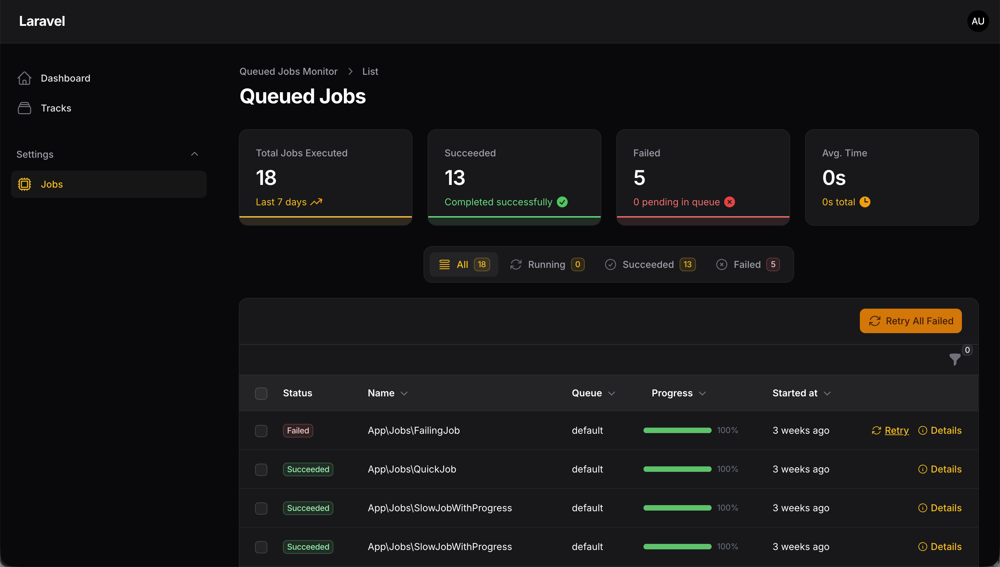
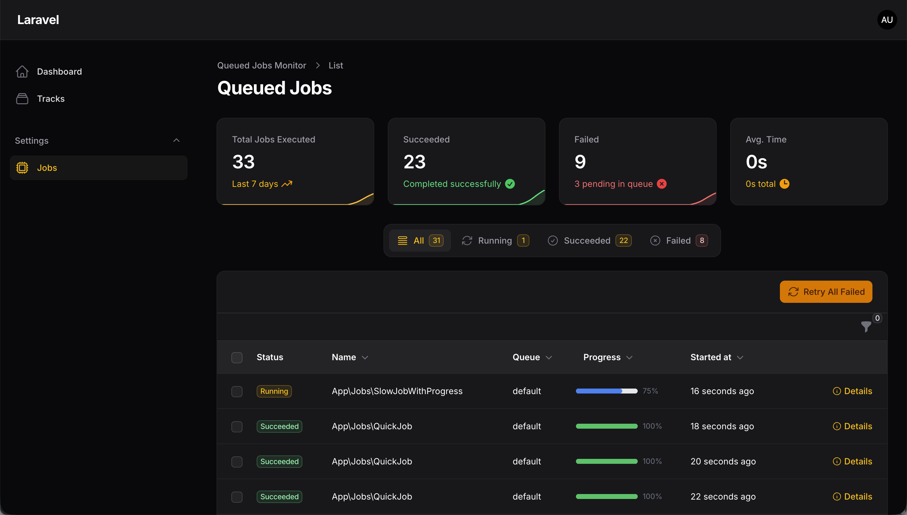

# Background Jobs monitoring like Horizon for all drivers for FilamentPHP

[](https://packagist.org/packages/croustibat/filament-jobs-monitor)
[](https://github.com/ultraviolettes/filament-jobs-monitor/actions/workflows/run-tests.yml)
[](https://github.com/ultraviolettes/filament-jobs-monitor/actions/workflows/phpstan.yml)
[](https://packagist.org/packages/croustibat/filament-jobs-monitor)

This is a package to monitor background jobs for FilamentPHP. It is inspired by Laravel Horizon and is compatible with all drivers.






## Installation

Check your filamentPHP version before installing:

| Version | FilamentPHP | PHP     |
| ------- | ----------- |---------|
| 1.*     | 2.*         | 8.1     |
| 2.*     | 3.*         | \>= 8.1 |
| 3.*     | 4.*         | \>= 8.1 |
| 4.*     | 4.*, 5.*    | \>= 8.2 |
| 5.*     | 5.*         | \>= 8.3 |

`5.*` requires Filament 5 and supports Laravel 12 and 13. `4.*` still supports Filament 4 and Laravel 11.28+, and is maintained on the [`4.x` branch](https://github.com/ultraviolettes/filament-jobs-monitor/tree/4.x).


Install the package via composer:

```bash
composer require croustibat/filament-jobs-monitor
```

Publish and run the migrations using:

```bash
php artisan vendor:publish --tag="filament-jobs-monitor-migrations"
php artisan migrate
```

## Usage

### Configuration

The global plugin config can be published using the command below:

```bash
php artisan vendor:publish --tag="filament-jobs-monitor-config"
```

This is the content of the published config file:

```php
return [
    'resources' => [
        'enabled' => true,
        'label' => 'filament-jobs-monitor::translations.model_label',
        'plural_label' => 'filament-jobs-monitor::translations.plural_model_label',
        'navigation_group' => 'filament-jobs-monitor::translations.navigation_group',
        'navigation_icon' => 'heroicon-o-cpu-chip',
        'navigation_sort' => null,
        'navigation_count_badge' => false,
        'resource' => Croustibat\FilamentJobsMonitor\Resources\QueueMonitorResource::class,
        'cluster' => null,
        'sub_navigation_position' => null, // SubNavigationPosition::Top, ::Start or ::End
        'polling_interval' => null, // e.g. '10s' to auto-refresh the job tables
    ],
    'failures' => [
        'enabled' => true,
        'polling_interval' => '10s',
    ],
    'pruning' => [
        'enabled' => true,
        'retention_days' => 7,
    ],
    'queues' => null, // null discovers them; or list them explicitly

    'queue_discovery' => [
        'cache_ttl' => 60,
    ],
    'tenancy' => [
        'enabled' => false,
        'model' => null, // e.g., App\Models\Tenant::class
        'column' => 'tenant_id',
    ],
];
```

**NOTE:** `label`, `plural_label` and `navigation_group` default to translation keys, so they follow the panel locale. Replace any of them with a plain string (`'label' => 'Job'`) to hard-code it: a value carrying neither a `::` namespace nor a `.` group is used verbatim and is never looked up in your application's JSON translation catalogue.

**NOTE:** `queues` is `null` by default, which discovers the queues instead of requiring a list: every queue seen in `queue_monitors`, in the `jobs` and `failed_jobs` tables, the default queue of each configured connection, and Horizon's supervised queues. That is what makes Redis and SQS work here — neither can enumerate its queues, but every queue a job ran on has been recorded. The result is cached for `queue_discovery.cache_ttl` seconds (60 by default). Setting `queues` to an explicit array skips discovery entirely.

**NOTE:** `resources.polling_interval` makes the **Job History** and **Pending jobs** tables refresh on their own, so the progress of a long-running job can be watched without reloading the page. It is disabled by default (`null`): a refresh of the Job History table also re-runs its four tab count badges, which is one count query per tab, so the interval is left to you. Any value Filament's `poll()` accepts works — `'5s'`, `'10s'`, `'1m'`. The **Failures** page has its own `failures.polling_interval`, already set to `'10s'`.

### Failures page

The **Failures** page groups failed jobs by signature — exception class, job class and normalised message (dynamic values such as ids, uuids and quoted strings are stripped) — so a thousand occurrences of the same error show up as a single row instead of a thousand, Sentry-style.

It includes:

- A stats overview: open groups, failures in the last hour, 24h failure rate and groups resolved in the last 7 days.
- A table of failure groups with occurrence counts, last-seen time and a 7-day sparkline per group, with **Open / Resolved / All** tabs and filters by exception class and queue.
- A detail slide-over per group with the stack trace of the last occurrence (app frames / all frames / raw toggle), the failed job payload rendered as a collapsible tree, and the most recent occurrences.
- Actions to **mark a group resolved** (a new occurrence reopens it automatically), **reopen** it, or **retry all failed jobs** of the group.

The page can be disabled with `'failures' => ['enabled' => false]`. Failure grouping requires the `add_failures_to_filament-jobs-monitor_table` migration — republish the migrations, migrate and publish the plugin assets when upgrading:

```bash
php artisan vendor:publish --tag="filament-jobs-monitor-migrations"
php artisan migrate
php artisan filament:assets
```

If the migration has not been run, the plugin keeps working as before and simply skips failure grouping.

### Pruning old records

The `QueueMonitor` model uses Laravel's [`Prunable`](https://laravel.com/docs/eloquent#pruning-models) trait and will prune records older than `pruning.retention_days` (default: 7 days) when `pruning.enabled` is `true`.

> **Important:** Laravel's built-in `php artisan model:prune` command only **auto-discovers** prunable models that live in your application's `app/Models` directory. Because `QueueMonitor` is shipped inside this package (`vendor/...`), it is **never** picked up by a bare `model:prune` call — this is the most common cause of "the model is not pruning".

You have two ways to prune the records:

**1. Use the dedicated command shipped with this package (recommended):**

```bash
php artisan filament-jobs-monitor:prune
```

This targets the package model directly, so it works regardless of your app structure. Schedule it in `routes/console.php` (Laravel 11+) or `app/Console/Kernel.php`:

```php
use Illuminate\Support\Facades\Schedule;

Schedule::command('filament-jobs-monitor:prune')->daily();
```

**2. Or call Laravel's `model:prune` with an explicit `--model` flag:**

```bash
php artisan model:prune --model="Croustibat\FilamentJobsMonitor\Models\QueueMonitor"
```

Pruning can also be toggled/configured at the plugin level:

```php
FilamentJobsMonitorPlugin::make()
    ->enablePruning() // or ->enablePruning(false) to disable
    ->pruningRetention(14); // keep records for 14 days
```

### Extending Model

Sometimes it's useful to extend the model to add some custom methods. You can do it by extending the model by creating your own model :

```php 
$ php artisan make:model MyQueueMonitor
```

Then you can extend the model by adding your own methods :

```php

    <?php

    namespace App\Models;

    use \Croustibat\FilamentJobsMonitor\Models\QueueMonitor as CroustibatQueueMonitor;

    class MyQueueMonitor extends CroustibatQueueMonitor {}

```

### Multi-Tenancy Support

This plugin supports multi-tenancy for applications using Filament's built-in tenant functionality. When enabled, job monitors are automatically filtered by the current tenant.

**Features:**
- Automatically associates jobs with tenants based on a `tenantId` property in your job class
- Filters the job monitor list to show only jobs for the current tenant
- Filters pending jobs and failed jobs by tenant (via payload inspection)
- Backwards compatible - disabled by default

**Configuration:**

Enable multi-tenancy in your published config file:

```php
'tenancy' => [
    'enabled' => true,
    'model' => App\Models\Tenant::class,  // Your tenant model
    'column' => 'tenant_id',              // Column name in queue_monitors table
],
```

**Migration:**

If you enable tenancy after initial installation, re-publish and run the migration to add the `tenant_id` column:

```bash
php artisan vendor:publish --tag="filament-jobs-monitor-migrations" --force
php artisan migrate
```

**Job Requirements:**

For jobs to be associated with a tenant, they must have a public `tenantId` property:

```php
class MyTenantJob implements ShouldQueue
{
    use Dispatchable, InteractsWithQueue, Queueable, SerializesModels;

    public function __construct(
        public int|string $tenantId,  // Required for multi-tenancy
        // ... other properties
    ) {}
}
```

When dispatching the job, pass the current tenant ID:

```php
MyTenantJob::dispatch(
    tenantId: Filament::getTenant()->id,
    // ... other arguments
);
```

See [examples/TenantAwareExportJob.php](./examples/TenantAwareExportJob.php) for a complete example.

### Using Filament Panels

If you are using Filament Panels, you can register the Plugin to your Panel configuration. This will register the plugin's resources as well as allow you to set configuration using optional chainable methods.

For example in your `app/Providers/Filament/AdminPanelProvider.php` file:

```php
<?php


use \Croustibat\FilamentJobsMonitor\FilamentJobsMonitorPlugin;

...

public function panel(Panel $panel): Panel
{
    return $panel
        ->plugins([
            FilamentJobsMonitorPlugin::make()
        ]);
}
```

## Usage

Just run a Background Job and go to the route `/admin/queue-monitors` to see the jobs.

## Example

Go to [example](./examples/) folder to see a Job example file.

Then you can call your Job with the following code:

```php
    public static function table(Table $table): Table
    {
        return $table

        // rest of your code
        ...

        ->bulkActions([
            BulkAction::make('export-jobs')
            ->label('Background Export')
            ->icon('heroicon-o-cog')
            ->action(function (Collection $records) {
                UsersCsvExportJob::dispatch($records, 'users.csv');
                Notification::make()
                    ->title('Export is ready')
                    ->body('Your export is ready. You can download it from the exports page.')
                    ->success()
                    ->seconds(5)
                    ->icon('heroicon-o-inbox-in')
                    ->send();
            })
        ])
    }
```

## Authorization

v5 puts every destructive action, and the job payloads themselves, behind an ability. Payloads
routinely carry customer data, and "Clear logs" truncates the monitor table, so a panel with more
than one role should not hand them to everyone who can open it.

**Nothing changes when upgrading**: an ability nobody covered is granted, as in v4. Flip
`authorization.fallback` to `false` once the abilities below are granted, and the plugin then
refuses anything the application has not allowed.

| Ability | Gate name | Policy method | Covers |
| --- | --- | --- | --- |
| View | `viewAnyQueueMonitor` | `viewAny` | the resource, the three pages and their routes |
| Retry | `retryQueueMonitor` | `retry` | retry, bulk retry, retry all failed, retry a failure group |
| Delete | `deleteQueueMonitor` | `delete` | deleting monitor records |
| Clear logs | `clearQueueMonitorLogs` | `clearLogs` | the "Clear logs" action, which truncates the table |
| Delete pending job | `deletePendingJob` | `deletePendingJob` | deleting queued jobs on the Pending page |
| Resolve failure | `resolveQueueMonitorFailure` | `resolveFailure` | marking a failure group resolved, and reopening it |

Each ability is resolved in this order, first match wins:

1. the closure or boolean set on the plugin;
2. a policy registered for the `QueueMonitor` model, when it implements the method;
3. a gate of the same name;
4. the `authorization.fallback` config key (`true` by default).

Denied abilities hide their action instead of failing on click, and a denied *View* makes the routes
return 403 rather than only hiding the navigation entry.

### With the plugin

```php
FilamentJobsMonitorPlugin::make()
    ->authorize(fn () => auth()->user()?->hasRole('admin'))
    ->authorizeRetry(fn () => auth()->user()?->can('retry_jobs'))
    ->authorizeClearLogs(fn () => auth()->user()?->hasRole('super-admin'))
```

The closure receives the record when the ability targets one. The other methods are
`authorizeDelete()`, `authorizeDeletePendingJob()` and `authorizeResolveFailure()`.

### With a policy

```php
// app/Policies/QueueMonitorPolicy.php
public function viewAny(User $user): bool
{
    return $user->hasPermissionTo('view jobs');
}

public function clearLogs(User $user): bool
{
    return $user->hasRole('super-admin');
}
```

```php
// AppServiceProvider::boot()
Gate::policy(\Croustibat\FilamentJobsMonitor\Models\QueueMonitor::class, QueueMonitorPolicy::class);
```

Plain gates (`Gate::define('clearQueueMonitorLogs', ...)`) and `spatie/laravel-permission` work the
same way, since both end up behind `Gate`. With **Filament Shield**, generate a policy for
`QueueMonitor` and add the abilities above to it.

### Denying anything that is not granted

```php
// config/filament-jobs-monitor.php
'authorization' => [
    'fallback' => false,
],
```

Recommended once the abilities are granted: an ability nobody covered is then refused instead of
allowed. Grant `viewAnyQueueMonitor` first, or the resource disappears from the panel.

### Batches and chains

Jobs dispatched inside `Bus::batch()` record their batch, so a monitor can be tied back to it:

```php
$monitor->batch();  // ?Illuminate\Bus\Batch, via Bus::findBatch()
$monitor->chain();  // Collection<QueueMonitor>, the steps of the chain in run order
```

This needs the `add_batches_to_filament-jobs-monitor_table` migration. Without it the package keeps
working exactly as before: the schema check is memoized, so a long-running worker pays for it once.

`chain_id` is stored and queried by `chain()`, but nothing populates it yet — Laravel has no chain
identifier, and propagating one through a chain needs a design decision (see #181).

### Slow job detection

A job that used to take 2s and now takes 90s is invisible until it starts timing out. The plugin
flags a run as slow when it crosses the absolute threshold, or when it takes more than
`anomaly_multiplier` times the median of its own job class — the latter only once that class has
`min_samples` finished runs, so a class seen three times cannot flag itself.

Flagged runs get a warning badge on the duration column with the reason in a tooltip, a `Slow`
option appears on the status filter, and the **Top slow jobs** widget lists the slowest classes with
their median, p95 and the trend against the previous window.

```php
// config/filament-jobs-monitor.php
'slow' => [
    'enabled' => true,
    'threshold_seconds' => 60,   // null disables the absolute limit
    'anomaly_multiplier' => 2.0,
    'min_samples' => 20,
    'window_days' => 7,
    'cache_ttl' => 300,
],
```

Medians and percentiles are computed in PHP from a single query over the window — SQLite and MySQL
have no portable percentile function — so the cost does not grow with the number of job classes.

Each flagged run dispatches `Croustibat\FilamentJobsMonitor\Events\JobMonitorSlow`, carrying the
monitor, the reason (`threshold` or `anomaly`), the duration, the class median and the ratio:

```php
Event::listen(JobMonitorSlow::class, function (JobMonitorSlow $event) {
    Log::warning("{$event->monitor->name} took {$event->duration}s ({$event->reason})");
});
```

### Sub-navigation layout

The Job History / Pending / Failures sub-navigation sits on top by default, because the three pages
are wide tables and a side column eats their horizontal space. Move it with the plugin:

```php
        // AdminPanelProvider.php
        ->plugins([
            FilamentJobsMonitorPlugin::make()
                ->subNavigationPosition(SubNavigationPosition::Start),
        ])
```

or with the `resources.sub_navigation_position` config key, which the plugin method overrides.
`SubNavigationPosition::Start`, `::End` and `::Top` are Filament's three positions; the matching
strings (`'start'`, `'end'`, `'top'`) are accepted in the config file.

### Enabling navigation

The navigation item is shown by default. When `enableNavigation()` is not called, it follows the `resources.enabled` config key; the fluent method always takes precedence over the config.

````php
        // AdminPanelProvider.php
        ->plugins([
            // ...
            FilamentJobsMonitorPlugin::make()
                ->enableNavigation(),
        ])
````

Or you can use a closure to enable navigation only for specific users:

```php

        // AdminPanelProvider.php
        ->plugins([
            // ...
            FilamentJobsMonitorPlugin::make()
                ->enableNavigation(
                    fn () => auth()->user()->can('view_queue_job') || auth()->user()->can('view_any_queue_job'),
                ),
        ])
```


## Changelog

Please see [CHANGELOG](CHANGELOG.md) for more information on what has changed recently.

## Contributing

Please see [CONTRIBUTING](.github/CONTRIBUTING.md) for details.

Translations are especially welcome: copy `resources/lang/en/translations.php` into your locale directory and translate the values, keeping the keys and the `:count` / `:minutes` / `:delta` placeholders untouched. `tests/Feature/TranslationParityTest.php` checks that a locale stays in sync with `en`; if you complete a locale listed in its `INCOMPLETE_LOCALES` constant, remove it from that list in the same PR.

## Security Vulnerabilities

Please review [our security policy](../../security/policy) on how to report security vulnerabilities.

## Credits

- [Croustibat](https://github.com/croustibat)
- [All Contributors](../../contributors)

## License

The MIT License (MIT). Please see [License File](LICENSE.md) for more information.
